# Bar Chores App — Application Flowchart

> Gamified bar staff task management system with three user roles.

---

## 1. High-Level Overview

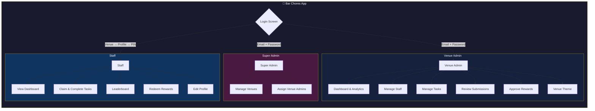

---

## 2. Authentication Flows

### Admin & Super Admin Login

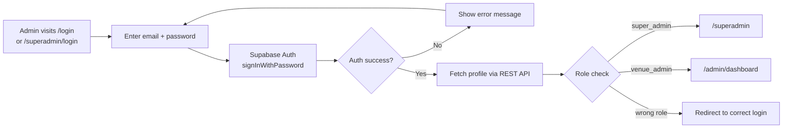

### Staff Login (PIN-Based)

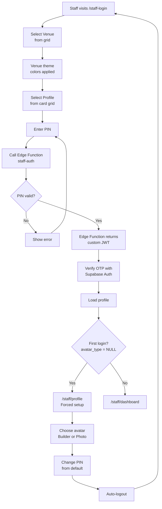

---

## 3. Staff Workflow

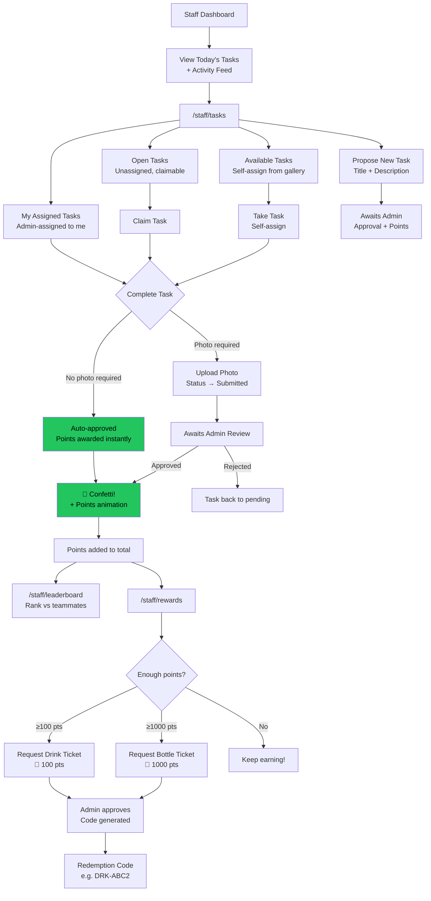

---

## 4. Venue Admin Workflow

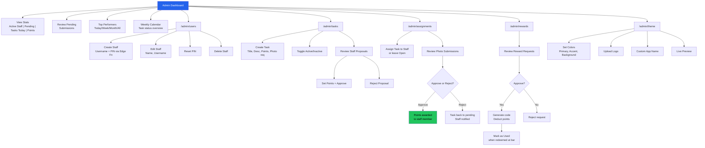

---

## 5. Super Admin Workflow

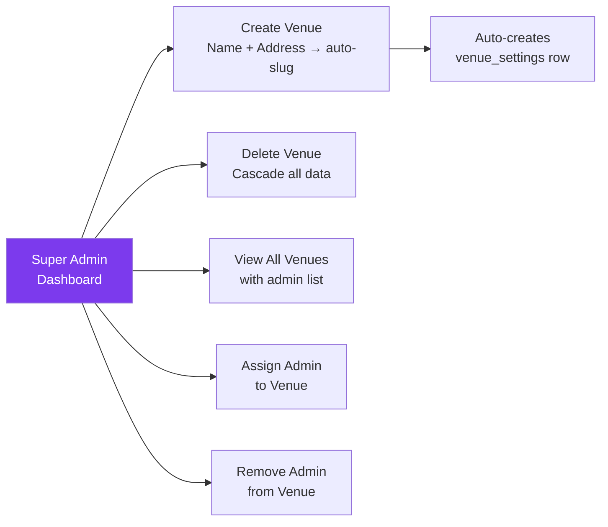

---

## 6. Task Lifecycle

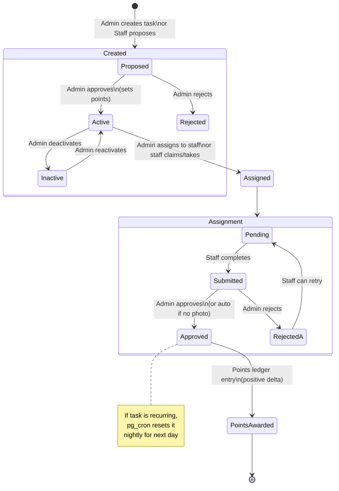

---

## 7. Points & Rewards Flow

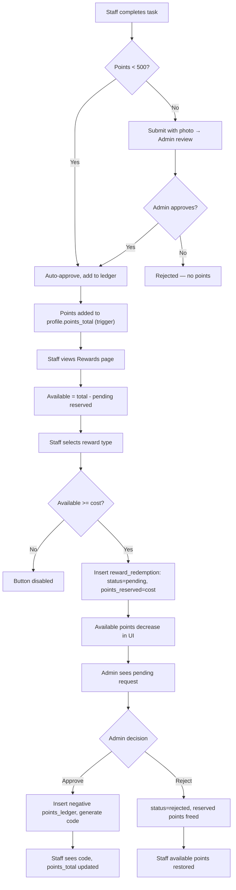

---

## 8. Data Flow Architecture

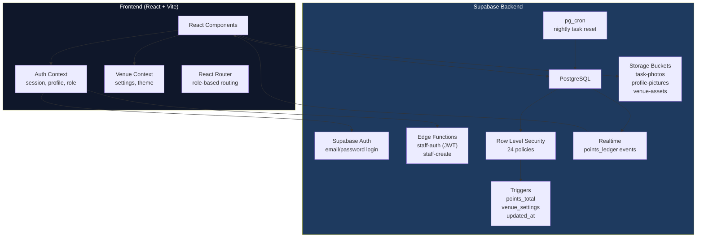

---

## 9. Route Map

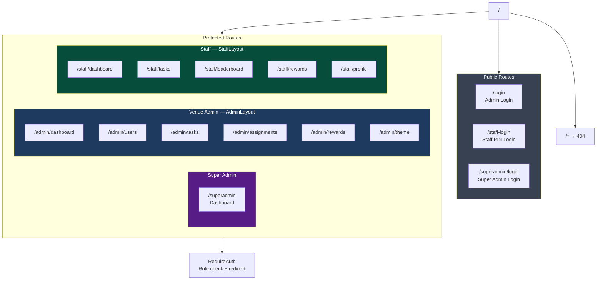

---

## 10. Environment & CI/CD Pipeline

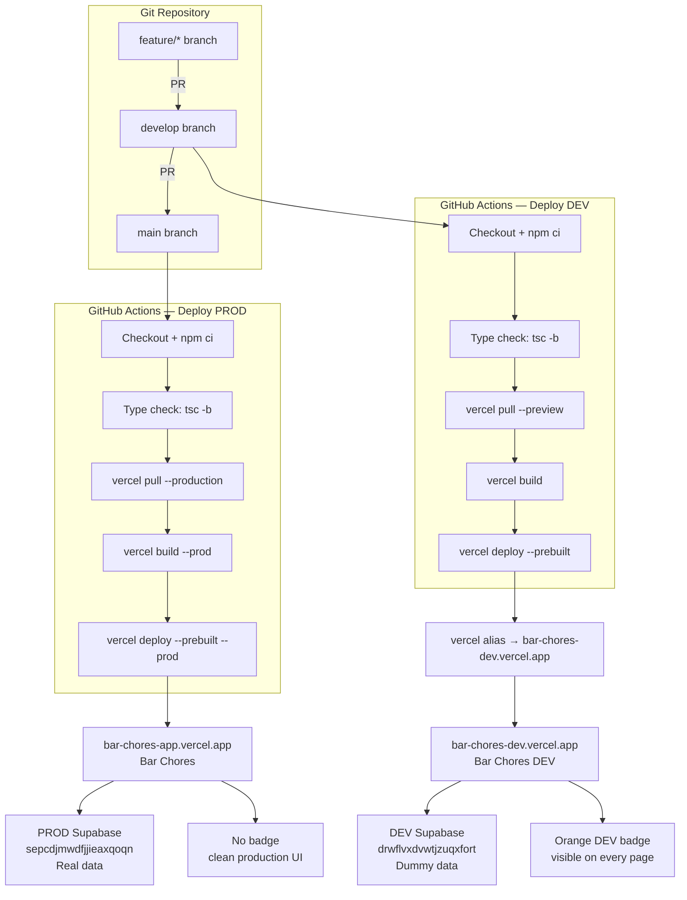

---

## 11. Database Schema Relationships

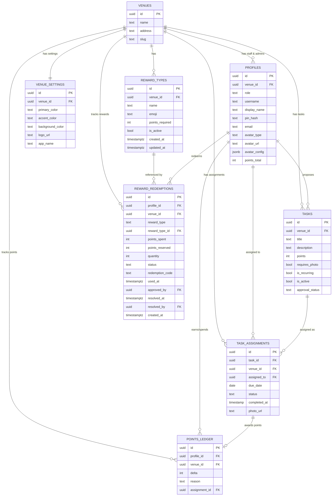

---

*Generated for Bar Chores App v1.8.5 — March 2026*
