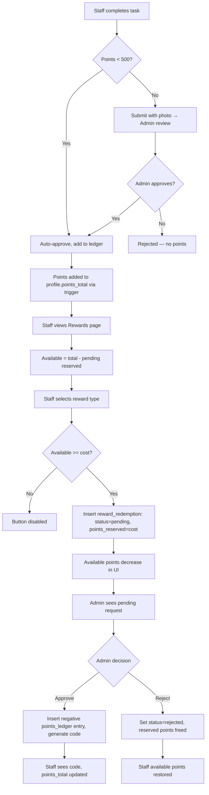

# DB Reset, Dynamic Rewards & UI Fixes — Implementation Plan

> **For Claude:** REQUIRED SUB-SKILL: Use superpowers:executing-plans to implement this plan task-by-task.

**Goal:** Fix bcrypt bug, mobile UI overflow, add dynamic per-venue reward types with reserve/approve flow, add DB reset button for super admin, update docs.

**Architecture:** Edge Functions handle all privileged operations (bcrypt, auth user CRUD, DB reset). Frontend uses direct Supabase queries scoped by RLS. New `reward_types` table per-venue. Available points computed at query time (points_total minus pending reserved).

**Tech Stack:** React 19 + Vite + TypeScript, Tailwind CSS v3, Supabase (Postgres, Edge Functions on Deno, Realtime), bcrypt via deno.land/x/bcrypt@v0.4.1.

**No test framework** — manual verification after each step.

---

## Task 1: Fix User Creation Bug (bcrypt hashSync)

**Files:**
- Modify: `supabase/functions/admin-actions/index.ts` (lines 127, 191, 217)
- Modify: `supabase/functions/staff-auth/index.ts` (line 60)
- Modify: `supabase/CLAUDE.md` (update bcrypt convention)

### Step 1: Fix bcrypt in admin-actions

In `supabase/functions/admin-actions/index.ts`, replace all 3 `hashSync` calls with async `hash`:

**Line 127 (create-staff):** Replace:
```ts
const pinHash = bcrypt.hashSync(pin, 10);
```
With:
```ts
const pinHash = await bcrypt.hash(String(pin), await bcrypt.genSalt(10));
```

**Line 191 (update-staff):** Replace:
```ts
updates.pin_hash = bcrypt.hashSync(pin, 10);
```
With:
```ts
updates.pin_hash = await bcrypt.hash(String(pin), await bcrypt.genSalt(10));
```

**Line 217 (reset-pin):** Replace:
```ts
const pinHash = bcrypt.hashSync(new_pin, 10);
```
With:
```ts
const pinHash = await bcrypt.hash(String(new_pin), await bcrypt.genSalt(10));
```

### Step 2: Fix bcrypt in staff-auth

In `supabase/functions/staff-auth/index.ts`, line 60. Replace:
```ts
const pinValid = bcrypt.compareSync(pin, profile.pin_hash);
```
With:
```ts
const pinValid = await bcrypt.compare(String(pin), profile.pin_hash);
```

Remove the comment about Sync on line 59.

### Step 3: Update supabase/CLAUDE.md

Change the bcrypt convention line from:
```
- bcrypt: `hashSync(pin, 10)` for creation, `compareSync(pin, hash)` for verification
```
To:
```
- bcrypt: `await bcrypt.hash(String(pin), await bcrypt.genSalt(10))` for creation, `await bcrypt.compare(String(pin), hash)` for verification (async only — hashSync crashes on Deno Deploy)
```

### Step 4: Deploy both Edge Functions

```bash
npx supabase functions deploy admin-actions --no-verify-jwt --project-ref drwflvxdvwtjzuqxfort
npx supabase functions deploy staff-auth --no-verify-jwt --project-ref drwflvxdvwtjzuqxfort
```

### Step 5: Test manually

1. Login as admin at `/login` with brian@rekom.dk / Admin1234!
2. Go to User Management, click "+ Add Staff"
3. Create user: username=`test.user`, display_name=`Test User`, pin=`9999`
4. Should succeed without "salt.charAt" error
5. Delete the test user after

### Step 6: Commit

```bash
git add supabase/functions/admin-actions/index.ts supabase/functions/staff-auth/index.ts supabase/CLAUDE.md
git commit -m "fix: replace bcrypt hashSync with async hash for Deno Deploy compat"
```

---

## Task 2: Fix Mobile UI — AdminTasks

**Files:**
- Modify: `src/pages/admin/AdminTasks.tsx`

### Step 1: Add overflow-x-auto and reduce padding

In `AdminTasks.tsx`, wrap the table in an overflow container and reduce cell padding on mobile.

**Line 210:** Replace:
```tsx
<div className="bg-slate-800 border border-slate-700 rounded-xl overflow-hidden">
```
With:
```tsx
<div className="bg-slate-800 border border-slate-700 rounded-xl overflow-hidden overflow-x-auto">
```

**Lines 218-225 (thead):** Replace all `px-6` with `px-3 md:px-6`:
```tsx
<tr className="text-left text-sm text-slate-400 border-b border-slate-700">
  <th className="px-3 md:px-6 py-3">Task</th>
  <th className="px-3 md:px-6 py-3">Points</th>
  <th className="px-3 md:px-6 py-3 hidden sm:table-cell">Photo</th>
  <th className="px-3 md:px-6 py-3 hidden sm:table-cell">Recurring</th>
  <th className="px-3 md:px-6 py-3">Status</th>
  <th className="px-3 md:px-6 py-3">Actions</th>
</tr>
```

**Lines 230-246 (tbody cells):** Same padding change + hide Photo/Recurring on mobile:
```tsx
<td className="px-3 md:px-6 py-4">
  <p className="text-white font-medium">{task.title}</p>
  {task.description && <p className="text-xs text-slate-400 mt-1 max-w-[200px] truncate">{task.description}</p>}
</td>
<td className="px-3 md:px-6 py-4 text-accent font-medium">{task.points}</td>
<td className="px-3 md:px-6 py-4 text-slate-400 hidden sm:table-cell">{task.requires_photo ? 'Yes' : 'No'}</td>
<td className="px-3 md:px-6 py-4 text-slate-400 hidden sm:table-cell">{task.is_recurring ? 'Daily' : 'One-time'}</td>
<td className="px-3 md:px-6 py-4">
  <span className={`text-xs px-2 py-1 rounded-full ${task.is_active ? 'bg-green-500/20 text-green-400' : 'bg-slate-600/20 text-slate-400'}`}>
    {task.is_active ? 'Active' : 'Inactive'}
  </span>
</td>
<td className="px-3 md:px-6 py-4">
  <div className="flex flex-col sm:flex-row gap-1 sm:gap-3">
    <button onClick={() => openEdit(task)} className="text-sm text-accent hover:text-primary">Edit</button>
    <button onClick={() => toggleActive(task)} className="text-sm text-yellow-400 hover:text-yellow-300">{task.is_active ? 'Disable' : 'Enable'}</button>
    <button onClick={() => handleDelete(task)} className="text-sm text-red-400 hover:text-red-300">Delete</button>
  </div>
</td>
```

### Step 2: Fix proposals section mobile layout

**Lines 176-203 (proposal items):** Replace the flex row layout with a stacking layout on mobile:
```tsx
<div key={task.id} className={`rounded-lg p-4 ${isRejected ? 'bg-red-500/10 border border-red-500/20' : 'bg-slate-700/50'}`}>
  <div className="flex-1 min-w-0 mb-3">
    <div className="flex items-center gap-2">
      <p className="text-white font-medium">{task.title}</p>
      {isRejected && <span className="text-xs px-2 py-0.5 rounded-full bg-red-500/20 text-red-400">Rejected</span>}
    </div>
    {task.description && <p className="text-sm text-slate-400 mt-1">{task.description}</p>}
    <p className="text-xs text-slate-500 mt-1">
      Proposed by {(task as any).proposer?.display_name || 'Unknown'}
    </p>
  </div>
  <div className="flex flex-wrap items-center gap-2">
    <input
      type="number" min={1}
      value={approvePoints[task.id] ?? ''}
      onChange={e => setApprovePoints(prev => ({ ...prev, [task.id]: Number(e.target.value) }))}
      className="w-20 px-3 py-2 bg-slate-600 border border-slate-500 rounded-lg text-white text-sm focus:outline-none focus:border-primary"
      placeholder="Pts"
    />
    <button onClick={() => approveProposal(task)}
      className="px-3 py-2 bg-green-600 text-white text-sm rounded-lg hover:bg-green-500 min-h-[36px]">{isRejected ? 'Re-approve' : 'Approve'}</button>
    {!isRejected && (
      <button onClick={() => rejectProposal(task)}
        className="px-3 py-2 bg-red-600 text-white text-sm rounded-lg hover:bg-red-500 min-h-[36px]">Reject</button>
    )}
  </div>
</div>
```

### Step 3: Test manually

1. Run `npm run dev`
2. Open Chrome DevTools → toggle device toolbar
3. Set to iPhone SE (375px) → navigate to admin tasks page
4. Verify: no horizontal overflow, table scrolls within container if needed
5. Verify: Photo/Recurring columns hidden on mobile
6. Verify: action buttons stack vertically on mobile
7. Test at 390px, 414px widths

### Step 4: Commit

```bash
git add src/pages/admin/AdminTasks.tsx
git commit -m "fix: make admin task management page responsive on mobile"
```

---

## Task 3: Dynamic Reward Types — Schema (Migration 006)

**Files:**
- Create: `supabase/migrations/006_reward_types_and_updates.sql`

### Step 1: Write the migration SQL

```sql
-- ============================================================
-- 006: Reward Types Table + Reward Redemptions Updates
-- ============================================================

-- 1. Create reward_types table (per-venue)
CREATE TABLE reward_types (
  id              uuid PRIMARY KEY DEFAULT gen_random_uuid(),
  venue_id        uuid NOT NULL REFERENCES venues(id) ON DELETE CASCADE,
  name            text NOT NULL,
  emoji           text DEFAULT '',
  points_required integer NOT NULL CHECK (points_required > 0),
  is_active       boolean DEFAULT true,
  created_at      timestamptz DEFAULT now(),
  updated_at      timestamptz DEFAULT now()
);

CREATE INDEX idx_reward_types_venue_id ON reward_types(venue_id);

-- 2. Trigger: auto-update updated_at on reward_types
CREATE OR REPLACE FUNCTION update_reward_types_timestamp()
RETURNS TRIGGER AS $$
BEGIN
  NEW.updated_at = now();
  RETURN NEW;
END;
$$ LANGUAGE plpgsql;

CREATE TRIGGER trg_reward_types_updated_at
  BEFORE UPDATE ON reward_types
  FOR EACH ROW EXECUTE FUNCTION update_reward_types_timestamp();

-- 3. RLS on reward_types
ALTER TABLE reward_types ENABLE ROW LEVEL SECURITY;

CREATE POLICY super_admin_all_reward_types ON reward_types
  FOR ALL USING (public.user_role() = 'super_admin');

CREATE POLICY admin_manage_venue_reward_types ON reward_types
  FOR ALL USING (venue_id = public.user_venue_id() AND public.user_role() = 'venue_admin');

CREATE POLICY staff_read_venue_reward_types ON reward_types
  FOR SELECT USING (venue_id = public.user_venue_id() AND public.user_role() = 'staff');

CREATE POLICY anon_read_reward_types ON reward_types
  FOR SELECT USING (true);

-- 4. Alter reward_redemptions: add new columns
ALTER TABLE reward_redemptions
  ADD COLUMN reward_type_id uuid REFERENCES reward_types(id),
  ADD COLUMN points_reserved integer NOT NULL DEFAULT 0,
  ADD COLUMN resolved_at timestamptz,
  ADD COLUMN resolved_by uuid REFERENCES profiles(id);

-- 5. Make reward_type column nullable (was NOT NULL with CHECK)
-- Drop the CHECK constraint first, then alter
ALTER TABLE reward_redemptions DROP CONSTRAINT IF EXISTS reward_redemptions_reward_type_check;
ALTER TABLE reward_redemptions ALTER COLUMN reward_type DROP NOT NULL;

-- 6. Index on new FK
CREATE INDEX idx_reward_redemptions_reward_type_id ON reward_redemptions(reward_type_id);

-- 7. Update supabase/CLAUDE.md note: Next migration number is 007
```

### Step 2: Run migration against DEV database

Since corporate firewall blocks port 5432, run via Supabase Management API:

```bash
# Copy the SQL and run via Supabase SQL Editor in the dashboard
# Or use the Management API if access token is available
```

Alternatively, paste the SQL into Supabase Dashboard → SQL Editor for the DEV project (`drwflvxdvwtjzuqxfort`).

### Step 3: Commit

```bash
git add supabase/migrations/006_reward_types_and_updates.sql
git commit -m "feat: add reward_types table and update reward_redemptions schema"
```

---

## Task 4: Dynamic Reward Types — TypeScript Types

**Files:**
- Modify: `src/types/database.ts`

### Step 1: Add RewardType interface and update RewardRedemption

Add after the `Task` interface (around line 61):
```ts
export interface RewardTypeRow {
  id: string;
  venue_id: string;
  name: string;
  emoji: string;
  points_required: number;
  is_active: boolean;
  created_at: string;
  updated_at: string;
}
```

Update `RewardRedemption` interface (lines 87-99) to:
```ts
export interface RewardRedemption {
  id: string;
  profile_id: string;
  venue_id: string;
  reward_type: RewardType | null;
  reward_type_id: string | null;
  points_spent: number;
  points_reserved: number;
  quantity: number;
  status: RewardStatus;
  redemption_code: string;
  used_at: string | null;
  approved_by: string | null;
  resolved_at: string | null;
  resolved_by: string | null;
  created_at: string;
}
```

### Step 2: Commit

```bash
git add src/types/database.ts
git commit -m "feat: add RewardTypeRow interface and update RewardRedemption type"
```

---

## Task 5: Admin Reward Types CRUD UI

**Files:**
- Modify: `src/pages/admin/AdminRewards.tsx`

### Step 1: Add reward types state and CRUD functions

Add at the top of `AdminRewards` component, alongside existing state:

```ts
// Reward types state
const [rewardTypes, setRewardTypes] = useState<RewardTypeRow[]>([]);
const [showTypeForm, setShowTypeForm] = useState(false);
const [editingType, setEditingType] = useState<RewardTypeRow | null>(null);
const [typeName, setTypeName] = useState('');
const [typeEmoji, setTypeEmoji] = useState('');
const [typePoints, setTypePoints] = useState(0);
```

Add import for `RewardTypeRow` from `../../types/database`.

Add load function:
```ts
async function loadRewardTypes() {
  if (!venueId) return;
  const { data } = await supabase
    .from('reward_types')
    .select('*')
    .eq('venue_id', venueId)
    .order('points_required');
  if (data) setRewardTypes(data as RewardTypeRow[]);
}
```

Call `loadRewardTypes()` in the existing `useEffect`.

Add CRUD handlers:
```ts
async function handleSaveType(e: React.FormEvent) {
  e.preventDefault();
  if (!venueId) return;
  if (editingType) {
    await supabase.from('reward_types').update({
      name: typeName, emoji: typeEmoji, points_required: typePoints,
    }).eq('id', editingType.id);
    setMessage(`Updated "${typeName}"`);
  } else {
    await supabase.from('reward_types').insert({
      venue_id: venueId, name: typeName, emoji: typeEmoji, points_required: typePoints,
    });
    setMessage(`Created "${typeName}"`);
  }
  setShowTypeForm(false); setEditingType(null);
  setTypeName(''); setTypeEmoji(''); setTypePoints(0);
  loadRewardTypes();
}

async function toggleTypeActive(type: RewardTypeRow) {
  await supabase.from('reward_types').update({ is_active: !type.is_active }).eq('id', type.id);
  loadRewardTypes();
}

async function deleteType(type: RewardTypeRow) {
  if (!confirm(`Delete "${type.name}"?`)) return;
  const { error: err } = await supabase.from('reward_types').delete().eq('id', type.id);
  if (err) { setMessage(`Cannot delete: ${err.message}`); return; }
  setMessage(`Deleted "${type.name}"`); loadRewardTypes();
}
```

### Step 2: Add reward types management section to JSX

Add before the existing rewards list section (before the filter buttons), a new "Reward Types" card:

```tsx
{/* Reward Types Management */}
<div className="bg-slate-800 border border-slate-700 rounded-xl p-5 mb-6">
  <div className="flex items-center justify-between mb-4">
    <h2 className="text-lg font-semibold text-white">Reward Types</h2>
    <button onClick={() => { setShowTypeForm(true); setEditingType(null); setTypeName(''); setTypeEmoji(''); setTypePoints(0); }}
      className="px-3 py-1.5 text-sm bg-primary text-slate-900 rounded-lg hover:bg-primary/90 min-h-[36px]">
      + Add Type
    </button>
  </div>

  {showTypeForm && (
    <form onSubmit={handleSaveType} className="bg-slate-700/50 rounded-lg p-4 mb-4 space-y-3">
      <div className="grid grid-cols-1 sm:grid-cols-3 gap-3">
        <div>
          <label className="block text-sm text-slate-300 mb-1">Name *</label>
          <input value={typeName} onChange={e => setTypeName(e.target.value)} required
            className="w-full px-3 py-2 bg-slate-700 border border-slate-600 rounded-lg text-white text-sm focus:outline-none focus:border-primary" placeholder="Hoodie" />
        </div>
        <div>
          <label className="block text-sm text-slate-300 mb-1">Emoji</label>
          <input value={typeEmoji} onChange={e => setTypeEmoji(e.target.value)}
            className="w-full px-3 py-2 bg-slate-700 border border-slate-600 rounded-lg text-white text-sm focus:outline-none focus:border-primary" placeholder="👕" />
        </div>
        <div>
          <label className="block text-sm text-slate-300 mb-1">Points *</label>
          <input type="number" value={typePoints} onChange={e => setTypePoints(Number(e.target.value))} min={1} required
            className="w-full px-3 py-2 bg-slate-700 border border-slate-600 rounded-lg text-white text-sm focus:outline-none focus:border-primary" />
        </div>
      </div>
      <div className="flex gap-2">
        <button type="submit" className="px-4 py-2 bg-primary text-slate-900 text-sm rounded-lg min-h-[36px]">
          {editingType ? 'Update' : 'Create'}
        </button>
        <button type="button" onClick={() => setShowTypeForm(false)} className="px-4 py-2 text-slate-300 border border-slate-600 text-sm rounded-lg min-h-[36px]">Cancel</button>
      </div>
    </form>
  )}

  {rewardTypes.length === 0 ? (
    <p className="text-slate-500 text-sm">No reward types configured.</p>
  ) : (
    <div className="space-y-2">
      {rewardTypes.map(type => (
        <div key={type.id} className={`flex items-center justify-between py-2 border-b border-slate-700/50 last:border-0 ${!type.is_active ? 'opacity-50' : ''}`}>
          <div className="flex items-center gap-3">
            <span className="text-xl">{type.emoji}</span>
            <div>
              <p className="text-white text-sm font-medium">{type.name}</p>
              <p className="text-xs text-accent">{type.points_required} pts</p>
            </div>
          </div>
          <div className="flex items-center gap-2">
            <button onClick={() => { setEditingType(type); setTypeName(type.name); setTypeEmoji(type.emoji); setTypePoints(type.points_required); setShowTypeForm(true); }}
              className="text-xs text-accent hover:text-primary">Edit</button>
            <button onClick={() => toggleTypeActive(type)}
              className="text-xs text-yellow-400 hover:text-yellow-300">{type.is_active ? 'Disable' : 'Enable'}</button>
            <button onClick={() => deleteType(type)}
              className="text-xs text-red-400 hover:text-red-300">Delete</button>
          </div>
        </div>
      ))}
    </div>
  )}
</div>
```

### Step 3: Update rewards display and approve logic

Update the existing `RewardRow` interface to include reward type join:
```ts
interface RewardRow {
  id: string;
  reward_type: string | null;
  reward_type_id: string | null;
  points_spent: number;
  points_reserved: number;
  quantity: number;
  status: string;
  redemption_code: string;
  used_at: string | null;
  created_at: string;
  redeemer: { display_name: string | null; username: string | null } | null;
  reward_type_info: { name: string; emoji: string } | null;
}
```

Update `loadRewards` select to join `reward_types`:
```ts
const { data } = await supabase
  .from('reward_redemptions')
  .select('*, redeemer:profiles!reward_redemptions_profile_id_fkey(display_name, username), reward_type_info:reward_types!reward_redemptions_reward_type_id_fkey(name, emoji)')
  .eq('venue_id', venueId)
  .order('created_at', { ascending: false });
```

Update `generateCode` to use reward type name:
```ts
function generateCode(typeName: string) {
  const prefix = typeName.replace(/[^A-Z]/gi, '').slice(0, 3).toUpperCase() || 'RWD';
  const chars = 'ABCDEFGHJKLMNPQRSTUVWXYZ23456789';
  let code = '';
  for (let i = 0; i < 4; i++) code += chars[Math.floor(Math.random() * chars.length)];
  return `${prefix}-${code}`;
}
```

Update display to use reward_type_info:
```tsx
<span className="text-lg">{r.reward_type_info?.emoji || (r.reward_type === 'drink_ticket' ? '🍺' : '🍾')}</span>
<p className="text-white font-medium">
  {r.reward_type_info?.name || (r.reward_type === 'drink_ticket' ? 'Drink' : 'Bottle')} Ticket x{r.quantity}
</p>
```

Update `handleApprove` to use the new code generation:
```ts
async function handleApprove(reward: RewardRow) {
  if (!profile || !venueId) return;
  const typeName = reward.reward_type_info?.name || reward.reward_type || 'RWD';
  const code = generateCode(typeName);
  await supabase.from('reward_redemptions').update({
    status: 'approved',
    redemption_code: code,
    approved_by: profile.id,
    resolved_at: new Date().toISOString(),
    resolved_by: profile.id,
  }).eq('id', reward.id);

  // Deduct points via points_ledger
  const { data: fullReward } = await supabase.from('reward_redemptions').select('profile_id, points_reserved').eq('id', reward.id).single();
  if (fullReward) {
    const pointsToDeduct = fullReward.points_reserved || reward.points_spent;
    await supabase.from('points_ledger').insert({
      profile_id: fullReward.profile_id,
      venue_id: venueId,
      delta: -pointsToDeduct,
      reason: `Redeemed: ${typeName} x${reward.quantity}`,
      created_by: profile.id,
    });
  }

  setMessage(`Approved! Code: ${code}`);
  loadRewards();
}
```

Update `handleReject` to set resolved fields:
```ts
async function handleReject(reward: RewardRow) {
  if (!profile) return;
  await supabase.from('reward_redemptions').update({
    status: 'rejected',
    resolved_at: new Date().toISOString(),
    resolved_by: profile.id,
  }).eq('id', reward.id);
  setMessage('Rejected — points released.');
  loadRewards();
}
```

### Step 4: Commit

```bash
git add src/pages/admin/AdminRewards.tsx src/types/database.ts
git commit -m "feat: add admin reward types CRUD and update rewards display"
```

---

## Task 6: Staff Rewards — Dynamic Types + Reserve Flow

**Files:**
- Modify: `src/pages/staff/StaffRewards.tsx`

### Step 1: Rewrite StaffRewards to use dynamic reward types

Replace the entire component with the new implementation:

**Key changes:**
1. Load `reward_types` from DB instead of hardcoded drink/bottle
2. Compute `availablePoints = points_total - SUM(pending reserved)`
3. Allow multiple pending requests (remove `hasPendingReward` gate)
4. Subscribe to Supabase Realtime for live updates
5. Use `reward_type_id` and `points_reserved` on insert

```tsx
import { useEffect, useState } from 'react';
import { supabase } from '../../lib/supabase';
import { useAuth } from '../../context/AuthContext';
import type { RewardTypeRow } from '../../types/database';

interface MyReward {
  id: string;
  reward_type: string | null;
  reward_type_id: string | null;
  points_spent: number;
  points_reserved: number;
  quantity: number;
  status: string;
  redemption_code: string;
  used_at: string | null;
  created_at: string;
  reward_type_info: { name: string; emoji: string } | null;
}

export default function StaffRewards() {
  const { profile, refreshProfile } = useAuth();
  const [rewardTypes, setRewardTypes] = useState<RewardTypeRow[]>([]);
  const [rewards, setRewards] = useState<MyReward[]>([]);
  const [loading, setLoading] = useState(true);
  const [requesting, setRequesting] = useState(false);
  const [message, setMessage] = useState('');
  const [error, setError] = useState('');

  const pointsTotal = profile?.points_total ?? 0;
  const pendingReserved = rewards
    .filter(r => r.status === 'pending')
    .reduce((sum, r) => sum + (r.points_reserved || r.points_spent), 0);
  const availablePoints = pointsTotal - pendingReserved;

  async function loadRewardTypes() {
    if (!profile?.venue_id) return;
    const { data } = await supabase
      .from('reward_types')
      .select('*')
      .eq('venue_id', profile.venue_id)
      .eq('is_active', true)
      .order('points_required');
    if (data) setRewardTypes(data as RewardTypeRow[]);
  }

  async function loadRewards() {
    if (!profile) return;
    const { data } = await supabase
      .from('reward_redemptions')
      .select('*, reward_type_info:reward_types!reward_redemptions_reward_type_id_fkey(name, emoji)')
      .eq('profile_id', profile.id)
      .order('created_at', { ascending: false });
    if (data) setRewards(data as unknown as MyReward[]);
    setLoading(false);
  }

  useEffect(() => {
    loadRewardTypes();
    loadRewards();
  }, [profile]);

  // Realtime subscription for reward status changes
  useEffect(() => {
    if (!profile) return;
    const channel = supabase.channel('staff-rewards')
      .on('postgres_changes', {
        event: '*',
        schema: 'public',
        table: 'reward_redemptions',
        filter: `profile_id=eq.${profile.id}`,
      }, () => {
        loadRewards();
        refreshProfile?.();
      })
      .on('postgres_changes', {
        event: 'INSERT',
        schema: 'public',
        table: 'points_ledger',
        filter: `profile_id=eq.${profile.id}`,
      }, () => {
        refreshProfile?.();
      })
      .subscribe();

    return () => { supabase.removeChannel(channel); };
  }, [profile?.id]);

  async function requestReward(type: RewardTypeRow) {
    if (!profile?.venue_id) return;
    if (availablePoints < type.points_required) { setError('Not enough points!'); return; }

    setRequesting(true); setError('');
    const tempCode = `PENDING-${Date.now()}`;
    const { error: err } = await supabase.from('reward_redemptions').insert({
      profile_id: profile.id,
      venue_id: profile.venue_id,
      reward_type_id: type.id,
      points_spent: type.points_required,
      points_reserved: type.points_required,
      quantity: 1,
      redemption_code: tempCode,
    });
    setRequesting(false);
    if (err) { setError(err.message); return; }
    setMessage(`${type.name} requested! Waiting for admin approval.`);
    loadRewards();
  }

  if (loading) return <div className="p-6 text-slate-400">Loading...</div>;

  return (
    <div className="p-4 space-y-6">
      {/* Points Balance */}
      <div className="bg-gradient-to-br from-primary/20 to-accent/20 border border-primary/30 rounded-2xl p-5 text-center">
        <p className="text-sm text-slate-300">Available Points</p>
        <p className="text-4xl font-bold text-primary">{availablePoints}</p>
        {pendingReserved > 0 && (
          <p className="text-xs text-yellow-400 mt-1">{pendingReserved} pts reserved (pending approval)</p>
        )}
      </div>

      {message && (
        <div className="bg-green-500/10 border border-green-500/30 text-green-400 px-4 py-3 rounded-lg text-sm flex justify-between">
          {message} <button onClick={() => setMessage('')}>×</button>
        </div>
      )}
      {error && (
        <div className="bg-red-500/10 border border-red-500/30 text-red-400 px-4 py-3 rounded-lg text-sm flex justify-between">
          {error} <button onClick={() => setError('')}>×</button>
        </div>
      )}

      {/* Redeem Options — dynamic from reward_types */}
      <div>
        <h2 className="text-lg font-bold text-white mb-3">Redeem Points</h2>
        {rewardTypes.length === 0 ? (
          <p className="text-slate-500 text-sm">No rewards available yet.</p>
        ) : (
          <div className="grid grid-cols-2 gap-3">
            {rewardTypes.map(type => (
              <button
                key={type.id}
                onClick={() => requestReward(type)}
                disabled={requesting || availablePoints < type.points_required}
                className="bg-slate-800 border border-slate-700 rounded-xl p-4 text-left hover:border-primary/50 transition-colors disabled:opacity-40"
              >
                <span className="text-2xl">{type.emoji}</span>
                <p className="text-white font-medium mt-2 text-sm">{type.name}</p>
                <p className="text-xs text-accent">{type.points_required.toLocaleString()} pts</p>
              </button>
            ))}
          </div>
        )}
      </div>

      {/* History */}
      <div>
        <h2 className="text-lg font-bold text-white mb-3">My Rewards</h2>
        {rewards.length === 0 ? (
          <p className="text-slate-500 text-sm">No rewards yet</p>
        ) : (
          <div className="space-y-2">
            {rewards.map(r => (
              <div key={r.id} className="bg-slate-800 border border-slate-700 rounded-xl p-4 flex items-center justify-between">
                <div>
                  <div className="flex items-center gap-2">
                    <span>{r.reward_type_info?.emoji || '🎁'}</span>
                    <p className="text-white font-medium">
                      {r.reward_type_info?.name || r.reward_type || 'Reward'} x{r.quantity}
                    </p>
                  </div>
                  <p className="text-xs text-slate-400 mt-1">{new Date(r.created_at).toLocaleDateString()}</p>
                  {r.status === 'approved' && r.redemption_code && !r.redemption_code.startsWith('PENDING') && (
                    <p className="text-sm font-mono text-accent mt-1">{r.redemption_code}</p>
                  )}
                </div>
                <span className={`text-xs px-2 py-1 rounded-full ${
                  r.status === 'approved' ? (r.used_at ? 'bg-slate-600/20 text-slate-400' : 'bg-green-500/20 text-green-400') :
                  r.status === 'rejected' ? 'bg-red-500/20 text-red-400' :
                  'bg-yellow-500/20 text-yellow-400'
                }`}>
                  {r.used_at ? 'Used' : r.status}
                </span>
              </div>
            ))}
          </div>
        )}
      </div>
    </div>
  );
}
```

**Note:** This requires `refreshProfile` to be available from `useAuth()`. Check if AuthContext already exposes it. If not, we need to add a `refreshProfile` function that re-fetches the profile from Supabase to update `points_total`.

### Step 2: Verify AuthContext has refreshProfile

Check `src/context/AuthContext.tsx`. If `refreshProfile` doesn't exist, add:

```ts
async function refreshProfile() {
  if (!user) return;
  const { data } = await supabase.from('profiles').select('*').eq('id', user.id).single();
  if (data) setProfile(data as Profile);
}
```

And expose it from the context value.

### Step 3: Commit

```bash
git add src/pages/staff/StaffRewards.tsx src/context/AuthContext.tsx
git commit -m "feat: dynamic reward types + reserve flow on staff rewards page"
```

---

## Task 7: DB Reset Feature — Edge Function

**Files:**
- Modify: `supabase/functions/admin-actions/index.ts` (add `reset-database` case)

### Step 1: Add reset-database action

Add a new `case 'reset-database':` block in the switch statement of `admin-actions/index.ts`, before the `default:` case.

The handler should:
1. Verify caller is `super_admin`
2. Delete all data in FK order using the `adminClient`
3. Delete all auth users except the caller (super admin)
4. Re-seed venues, admin auth users + profiles, staff auth users + profiles, reward_types, tasks, task_assignments
5. Return a summary of seeded counts

The seed data is hardcoded inline from SEED_DATA.md. Key data:
- 2 venues (Little Green Door, KOKO)
- 2 admins (brian@rekom.dk, bn@rekom.dk — password: Admin1234!)
- 10 staff (5 per venue with PINs)
- 4 reward types per venue (Drink Ticket 100, Tote Bag 500, Bottle Ticket 1000, Hoodie 2000)
- 40 tasks (20 per venue)
- 10 task assignments (1 per staff)

**Important:** Staff creation must use `adminClient.auth.admin.createUser()` + bcrypt hash for PINs.

### Step 2: Deploy Edge Function

```bash
npx supabase functions deploy admin-actions --no-verify-jwt --project-ref drwflvxdvwtjzuqxfort
```

### Step 3: Commit

```bash
git add supabase/functions/admin-actions/index.ts
git commit -m "feat: add reset-database action to admin-actions Edge Function"
```

---

## Task 8: DB Reset Feature — Super Admin UI

**Files:**
- Modify: `src/pages/superadmin/SuperAdminDashboard.tsx`

### Step 1: Add reset DB state and handler

Add state:
```ts
const [resetting, setResetting] = useState(false);
const [resetConfirm, setResetConfirm] = useState('');
const [showResetDialog, setShowResetDialog] = useState(false);
const [resetProgress, setResetProgress] = useState('');
```

Add handler:
```ts
async function handleResetDatabase() {
  if (resetConfirm !== 'RESET') return;
  setResetting(true); setResetProgress('Resetting database...');
  setError('');

  const { data, error: err } = await adminAction<{ message: string; counts: Record<string, number> }>('reset-database', {});

  setResetting(false); setShowResetDialog(false); setResetConfirm('');
  if (err) {
    setError(`Reset failed: ${err}`);
    setResetProgress('');
  } else {
    setMessage(data?.message || 'Database reset complete!');
    setResetProgress('');
    loadVenues();
    loadUnassignedAdmins();
  }
}
```

### Step 2: Add UI button and confirmation dialog

In the actions section (after the "+ New Venue" button, around line 268), add:
```tsx
<button
  onClick={() => setShowResetDialog(true)}
  className="px-4 py-2.5 bg-red-600 text-white font-medium rounded-lg hover:bg-red-500 transition-colors min-h-[48px]"
>
  Reset Database
</button>
```

Below the actions section, add the confirmation dialog:
```tsx
{showResetDialog && (
  <div className="bg-red-500/10 border border-red-500/30 rounded-xl p-6 space-y-4">
    <h2 className="text-lg font-semibold text-red-400">Reset Database</h2>
    <p className="text-sm text-slate-300">
      This will <strong>delete ALL data</strong> (venues, staff, tasks, points, rewards) and re-seed from scratch. Your super admin account will be preserved.
    </p>
    <div>
      <label className="block text-sm text-slate-300 mb-1">Type RESET to confirm</label>
      <input
        value={resetConfirm}
        onChange={e => setResetConfirm(e.target.value)}
        className="w-full px-4 py-3 bg-slate-700 border border-red-500/50 rounded-lg text-white focus:outline-none focus:border-red-400"
        placeholder="RESET"
      />
    </div>
    {resetProgress && <p className="text-sm text-yellow-400">{resetProgress}</p>}
    <div className="flex gap-3">
      <button
        onClick={handleResetDatabase}
        disabled={resetConfirm !== 'RESET' || resetting}
        className="px-6 py-2.5 bg-red-600 text-white font-medium rounded-lg hover:bg-red-500 disabled:opacity-50 min-h-[48px]"
      >
        {resetting ? 'Resetting...' : 'Confirm Reset'}
      </button>
      <button
        onClick={() => { setShowResetDialog(false); setResetConfirm(''); }}
        className="px-6 py-2.5 text-slate-300 border border-slate-600 rounded-lg min-h-[48px]"
      >
        Cancel
      </button>
    </div>
  </div>
)}
```

### Step 3: Commit

```bash
git add src/pages/superadmin/SuperAdminDashboard.tsx
git commit -m "feat: add Reset Database button to super admin dashboard"
```

---

## Task 9: Update Seed Data Documentation

**Files:**
- Modify: `docs/api/seed-data.md`

### Step 1: Add reward types section

After the "Staff Users" section and before "Tasks", add:

```markdown
---

## 🎁 Reward Types (per venue)

Each venue gets the same 4 default reward types:

| Name | Emoji | Points Required |
|------|-------|----------------|
| Drink Ticket | 🍺 | 100 |
| Tote Bag | 👜 | 500 |
| Bottle Ticket | 🍾 | 1,000 |
| Hoodie | 👕 | 2,000 |
```

### Step 2: Update expected result table

Update the "Expected Result After Seeding" table to include reward_types:

```markdown
| Table | Expected Rows |
|-------|--------------|
| venues | 2 |
| venue_settings | 2 (auto-created by trigger) |
| profiles | 13 (1 super admin + 2 admins + 10 staff) |
| reward_types | 8 (4 per venue) |
| tasks | 40 |
| task_assignments | 10 (1 per staff member) |
| points_ledger | 0 (clean start) |
| reward_redemptions | 0 (none yet) |
```

### Step 3: Commit

```bash
git add docs/api/seed-data.md
git commit -m "docs: update seed data with reward types"
```

---

## Task 10: Update Flowcharts & Architecture Docs

**Files:**
- Modify: `docs/architecture/app-flowchart.md` (update rewards flow diagram, add reward_types to ERD)
- Modify: `docs/architecture/technical-reference.md` (update rewards section)

### Step 1: Update rewards flow in app-flowchart.md

Replace the existing "Points & Rewards Flow" Mermaid diagram with the new reserve→approve flow:



### Step 2: Update DB ERD

Add `reward_types` table and updated `reward_redemptions` columns to the ERD diagram.

### Step 3: Update technical-reference.md

In the "Points & Rewards" section, update to describe:
- Dynamic reward types (per-venue, admin CRUD)
- Reserve → approve/reject flow
- Available points calculation

### Step 4: Commit

```bash
git add docs/architecture/app-flowchart.md docs/architecture/technical-reference.md
git commit -m "docs: update flowcharts and technical reference for dynamic rewards"
```

---

## Task 11: Final — Update CLAUDE.md migration number and version bump

**Files:**
- Modify: `supabase/CLAUDE.md` — change next migration from 006 to 007
- Modify: `package.json` — bump version (1.8.5 → 1.9.0)

### Step 1: Commit

```bash
git add supabase/CLAUDE.md package.json
git commit -m "chore: bump version to 1.9.0 and update migration counter"
```

---

## Execution Order Summary

| # | Task | Type | Depends On |
|---|------|------|------------|
| 1 | Fix bcrypt hashSync | Bug fix | — |
| 2 | Fix mobile UI AdminTasks | Bug fix | — |
| 3 | Migration 006: reward_types + schema | Schema | — |
| 4 | TypeScript types update | Types | 3 |
| 5 | Admin reward types CRUD UI | Feature | 3, 4 |
| 6 | Staff rewards dynamic + reserve flow | Feature | 3, 4 |
| 7 | DB reset Edge Function action | Feature | 3 |
| 8 | Super admin reset UI | Feature | 7 |
| 9 | Update seed-data.md | Docs | 3 |
| 10 | Update flowcharts & tech reference | Docs | 5, 6 |
| 11 | Version bump + migration counter | Chore | All |

Tasks 1-2 can run in parallel. Tasks 3-4 are sequential. Tasks 5-6 can run in parallel after 4. Task 7 after 3. Task 8 after 7. Tasks 9-10 after features. Task 11 last.
